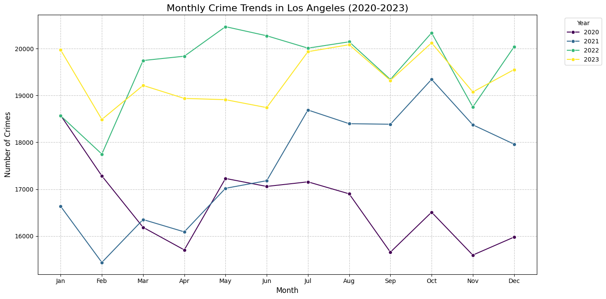
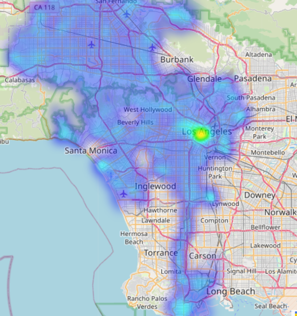
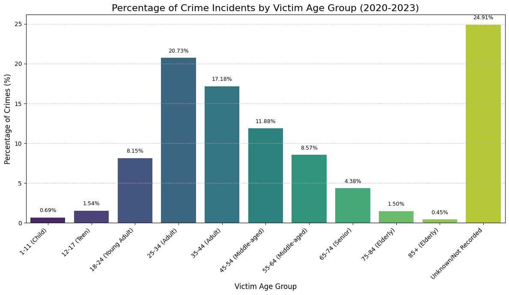
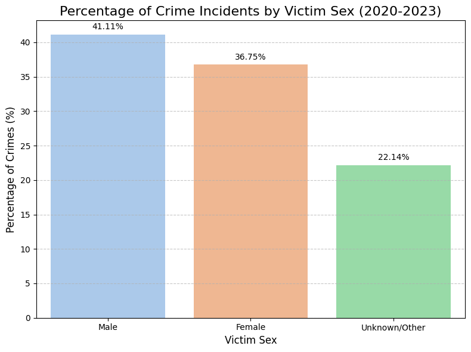
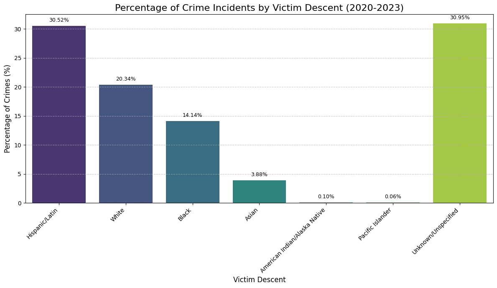

# los-angeles-crimes
An in-depth analysis of Los Angeles crime data from 2020 onwards, focusing on trends, patterns, and geographical distributions using Python for data cleaning, EDA, and visualization.

# Los Angeles Crime Data Analysis (2020-Present)

## Project Description
This project focuses on exploring and analyzing incident-level crime data from the City of Los Angeles, covering incidents from 2020 to the present. The aim is to uncover patterns, trends, and insights into crime occurrences across different dimensions such as time, location, and crime type. This analysis demonstrates skills in data cleaning, exploratory data analysis (EDA), and data visualization using Python.

## Problem Statement & Goals
The primary goals of this analysis are to:
* Identify the most common types of crimes reported in Los Angeles.
* Analyze crime trends over time (e.g., monthly, quarterly, yearly patterns).
* Investigate the geographical distribution of crimes to identify high-incidence areas.
* Explore relationships between crime incidents and other available attributes (e.g., victim age, sex, descent, premise description).
* Provide data-driven insights that could potentially inform community safety initiatives or resource allocation.

## Data Source
The dataset used in this project is the "Los Angeles Crime Data from 2020" provided by the Los Angeles Police Department (LAPD) via [data.gov](https://catalog.data.gov/dataset/crime-data-from-2020-to-present).

**Important Data Notes:**
* It's important to note that the crime data for 2024 and 2025 within the dataset is incomplete due to the adoption of a new Records Management System for reporting crimes and arrests by the Los Angeles Police Department in 2024. As observed in an initial time trend analysis, records for 2024 show a significant drop-off towards the latter half of the year, and 2025 only contains minimal entries. To ensure accuracy and avoid misinterpreting trends based on partial data, this project will filter the dataset to include crime incidents up to and including December 31, 2023. All analyses and findings presented are therefore based on the complete data up to the end of 2023.
* A significant proportion of crime incidents (approximately 24.91%) have victim age recorded as 'Unknown/Not Recorded' (or 0/negative in the raw data). This substantial data gap means that while our analysis provides valuable insights into the age demographics of *known* victims, these findings may not fully represent the age distribution across *all* crime incidents. The presence of such a large "unknown" category limits the comprehensiveness of victim age-based conclusions and highlights a potential area for improved data collection.
* Similar to victim age, a notable portion of the data, approximately **22.14%**, falls under the 'Unknown/Other' category for victim sex. This combines instances where the sex was not specified, was recorded as 'X', or contained clear data entry errors ('H', '-'). This significant data gap indicates a limitation in fully understanding the sex demographics for all crime incidents and should be kept in mind when interpreting the presented proportions.
* A significant finding from the dataset is that the largest single category for victim descent is **'Unknown/Unspecified' at 30.95%**. This substantial proportion indicates a considerable data gap, meaning that nearly a third of all crime incidents lack recorded victim descent information. This limitation is crucial to consider when interpreting the distribution among the identified descent groups, as the full picture of victim demographics remains partially obscured.
* The data is transcribed from original paper crime reports and may contain some inaccuracies.
* Some location fields with missing data are noted as `(0°, 0°)`. These will require careful handling during analysis.
* Address fields are provided only to the nearest hundred block to maintain privacy.

## Technologies Used
* **Python**
* **Pandas:** For data manipulation and analysis.
* **NumPy:** For numerical operations.
* **Matplotlib:** For basic plotting and visualization.
* **Seaborn:** For enhanced statistical data visualization.
* **(Potentially others as needed):** e.g., Plotly for interactive visualizations, SciPy for statistical tests.

### Key Findings and Insights

This data analysis project investigates Los Angeles crime data from 2020 to December 31, 2023, employing statistical methods to identify and analyze prevalent crime types and their trends over time.

**Most Prevalent Crime Types:**
An examination of crime descriptions revealed the most common offenses reported in Los Angeles during the period of analysis:
* The data indicates a strong prevalence of **property-related crimes**. **"VEHICLE - STOLEN"** remains the most frequent, accounting for $\approx 10.68\%$ of all reported crimes. This is followed by **"BATTERY - SIMPLE ASSAULT,"** **"THEFT OF IDENTITY,"** and **"BURGLARY FROM VEHICLE."**
* While property crimes dominate the top ranks, the significant presence of various **assault types** highlights areas of concern beyond just property loss. These include **"BATTERY - SIMPLE ASSAULT,"** **"ASSAULT WITH DEADLY WEAPON, AGGRAVATED ASSAULT,"** and **"INTIMATE PARTNER - SIMPLE ASSAULT."**

### Crime Trends Over Time

**Crime Trends Over Time (2020-2023):**
Analyzing monthly crime trends for each year provides a visual understanding of shifts in reported incidents:

* **Overall Increase followed by a Slight Decline:** The graph clearly illustrates that crime counts in **2022 (green line)** and **2023 (yellow line)** are consistently higher across most months compared to **2020 (black line)** and **2021 (blue line)**. This indicates a general upward trend in reported crimes from the earlier years, peaking in 2022, followed by a slight moderation in 2023.
* **Limited Consistent Monthly Seasonality:** While minor fluctuations are visible, the plot does not reveal a strong, repeatable seasonal pattern across all years (e.g., a distinct, consistent peak or trough month). This suggests that while subtle influences might be present, they aren't the primary drivers of overall crime volume in Los Angeles during this period.
* **Year-Specific Observations:**
    * **2020 (Black Line):** Represents the lowest crime reporting year in the dataset, providing a baseline.
    * **2021 (Blue Line):** Shows an increase from 2020, but generally stays below the levels of the subsequent two years.
    * **2022 (Green Line):** Stands out as the year with the highest overall monthly crime counts, indicating a peak in reported incidents during this period.
    * **2023 (Yellow Line):** While still high, this line generally runs slightly below the 2022 peak, suggesting a modest decrease or leveling off in crime reporting.

### Geographical Distribution of Crimes

To understand where crime incidents are most concentrated in Los Angeles, we analyzed the geographical distribution of reported crimes based on LAPD's reporting areas and visualized this data using a heatmap.

**Analysis by Reporting Area (AREA NAME):**
The top 15 areas with the highest number of reported crimes between 2020 and December 31, 2023, are:

| AREA NAME      | Crime Count | Percentage of Total (%) |
|----------------|-------------|-------------------------|
| Central        | 59456       | 6.78                    |
| 77th Street    | 54981       | 6.27                    |
| Pacific        | 51351       | 5.85                    |
| Southwest      | 49127       | 5.60                    |
| Hollywood      | 46277       | 5.27                    |
| Southeast      | 44325       | 5.05                    |
| Olympic        | 44300       | 5.05                    |
| N Hollywood    | 43857       | 5.00                    |
| Newton         | 43787       | 4.99                    |
| Wilshire       | 41933       | 4.78                    |
| Rampart        | 41223       | 4.70                    |
| West LA        | 40313       | 4.59                    |
| Northeast      | 37703       | 4.30                    |
| Van Nuys       | 37122       | 4.23                    |
| West Valley    | 36863       | 4.20                    |

The "Central" area, encompassing Downtown Los Angeles, exhibits the highest crime volume, accounting for nearly 7% of all reported incidents. Several other divisions, particularly in South Los Angeles, Hollywood, and the Wilshire area, also show significant concentrations of crime.

**Heatmap Visualization:**
To visually complement this analysis, a geographical heatmap was generated using the latitude and longitude coordinates of the crime incidents.

The heatmap clearly illustrates areas with a higher density of crime incidents through warmer color intensities. Consistent with the area-based analysis, the heatmap visibly highlights Downtown Los Angeles and portions of South Los Angeles, Hollywood, and other commercially dense areas as high-incidence zones. This visualization provides a compelling spatial understanding of crime patterns across the city.

These findings underscore the uneven distribution of crime within Los Angeles, emphasizing the need for targeted strategies and resource allocation in these high-incidence areas.

### Victim Age Group Analysis

Understanding the demographics of crime victims can reveal important patterns and inform targeted prevention efforts. This section analyzes the distribution of crime incidents across different victim age groups.

**Key Findings from Age Group Distribution:**
Among the incidents where victim age was recorded, distinct patterns emerged:
* **Peak Victimization in Mid-Adult Ages:** The highest percentages of crime victims fall within the **25-34 (Adult)** age group (20.73% of total crimes), followed closely by the **35-44 (Adult)** age group (17.18%). These two groups combined account for over 37% of all recorded victims. This suggests that adults in their mid-twenties to mid-forties are disproportionately affected by crime, likely due to their higher levels of social and economic activity.
* **Young Adult Vulnerability:** The **18-24 (Young Adult)** group also shows a significant proportion of victims at 8.15%, indicating a continued high level of risk in early adulthood.
* **Lower Incidence at Age Extremes:** Crime victimization rates are considerably lower for the youngest age groups (`1-11 (Child)` at 0.69% and `12-17 (Teen)` at 1.54%) and the oldest age groups (`65-74 (Senior)` at 4.38%, `75-84 (Elderly)` at 1.50%, and `85+ (Elderly)` at 0.45%). While serious, this proportional reduction might be influenced by factors such as reduced exposure to high-risk environments or different reporting patterns.

**Visualization: Percentage of Crime Incidents by Victim Age Group**
The bar chart below visually represents the percentage distribution of crime incidents across the identified victim age groups, including the proportion of unknown ages.

This visualization clearly highlights the age groups most impacted by crime and underscores the significant portion of incidents where victim age remains unrecorded, guiding future data collection improvements and targeted intervention strategies.

### Victim Sex Distribution Analysis

Understanding the sex distribution among crime victims provides another layer of insight into crime patterns and potential vulnerabilities. This section analyzes the reported sex of victims for crime incidents in Los Angeles.

**Key Findings from Sex Distribution:**
Among the incidents where victim sex was identified:
* **Male victims** account for the largest proportion, at **41.11%** of all crime incidents.
* **Female victims** follow closely, representing **36.75%** of all incidents.

While males are slightly more often reported as victims, the proportions between male and female victims are relatively close, suggesting that both sexes experience significant levels of victimization across reported crimes in Los Angeles. The 'Unknown/Other' category's size, however, means a portion of the distribution remains unclassified.

**Visualization: Percentage of Crime Incidents by Victim Sex**
The bar chart below illustrates the percentage distribution of crime incidents based on the sex of the victim.

This visualization clearly shows the proportions of male, female, and unknown/other victims, providing a concise overview of victim sex demographics in the dataset.

### Victim Descent Distribution Analysis

Analyzing the descent of crime victims can reveal important patterns and potential disparities in victimization across different communities. This section examines the distribution of crime incidents based on the victim's reported descent.

**Key Findings from Descent Distribution:**
Among the incidents where victim descent was recorded, distinct patterns emerged:

* **Dominance of Hispanic/Latin Victims:** **Hispanic/Latin individuals represent the largest known group of victims, accounting for 30.52%** of all crime incidents.
* **Significant Proportions for White and Black Victims:** **White victims** constitute the second-largest group at **20.34%**, followed by **Black victims** at **14.14%**. These three groups combined (`Hispanic/Latin`, `White`, and `Black`) make up the vast majority of identified crime victims in the dataset.
* **Other Identified Descent Groups:**
    * **Asian victims** account for **3.88%** of incidents.
    * **American Indian/Alaska Native victims** represent **0.1%**.
    * **Pacific Islander victims** are at **0.06%**.
    While these groups have smaller proportional representations, their explicit categorization allows for a more detailed and accurate understanding of victimization patterns within these specific communities.

**Visualization: Percentage of Crime Incidents by Victim Descent**
The bar chart below visually represents the percentage distribution of crime incidents across the victim descent categories. For clarity, the 'Unknown/Unspecified' category has been placed at the end of the chart to allow for easier comparison among the identified descent groups, while still clearly showing the proportion of unclassified data.

This analysis underscores the importance of victim descent data for understanding community impact, while also highlighting the need for improved data collection regarding victim demographics.

## Google Colab Notebook
[Link to Live Colab Notebook](https://github.com/vonlanot/los-angeles-crimes/blob/main/LA_Crime_Notebook.ipynb)

## How to Explore
1.  Click on the "Link to Live Colab Notebook" above.
2.  The notebook will open directly in Google Colab.
3.  You can view the code, outputs, and explanations. To run the code yourself, you can select "File" > "Save a copy in Drive" or "Save a copy in GitHub" to create your own editable version.
