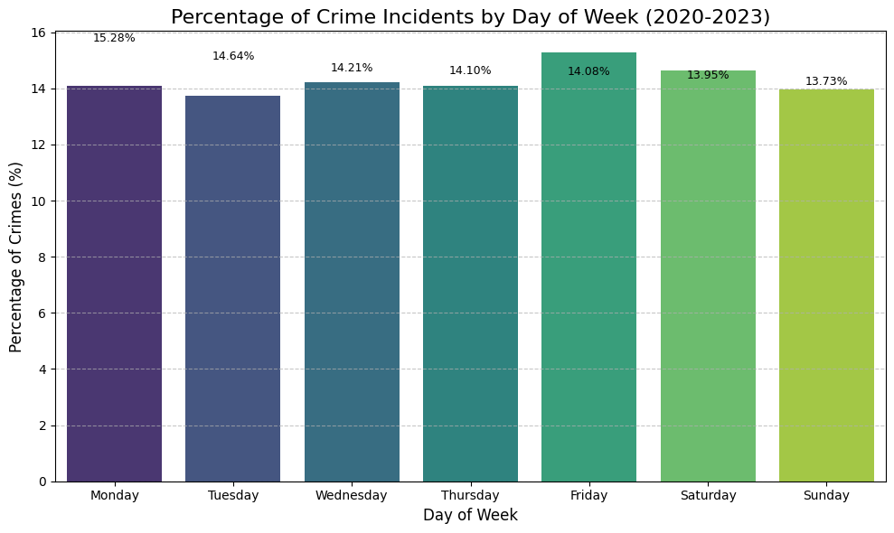
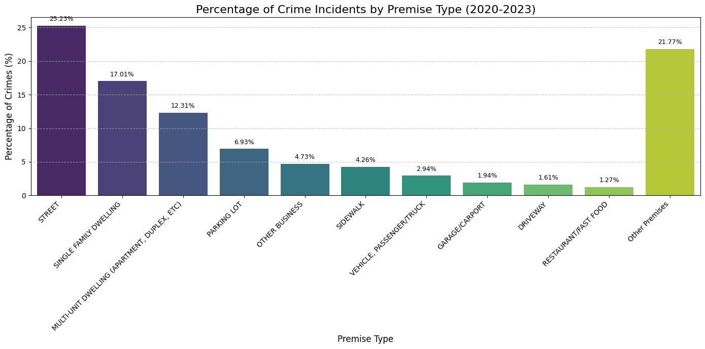

# los-angeles-crimes
An in-depth analysis of Los Angeles crime data from 2020 onwards, focusing on trends, patterns, and geographical distributions using Python for data cleaning, EDA, and visualization.

# Los Angeles Crime Data Analysis (2020-2023)

## Project Description
This project conducts an in-depth exploratory data analysis (EDA) of incident-level crime data from the City of Los Angeles, specifically covering incidents from **2020 to 2023**. Utilizing Python, Pandas, and visualization libraries, the analysis aims to uncover significant patterns, trends, and key insights into crime occurrences across various dimensions, including temporal factors, geographical distribution, victim demographics, and premise types. This work showcases practical skills in data cleaning, transformation, statistical analysis, and compelling data visualization.

## Problem Statement & Goals
The primary objective of this analysis is to leverage Los Angeles crime data to extract actionable insights that can inform public safety strategies and resource allocation. Key analytical goals include:

* Identifying the most common types of crimes reported in Los Angeles.
* Analyzing crime trends over specific timeframes (e.g., monthly, yearly patterns) to understand temporal dynamics.
* Investigating the geographical distribution of crimes to pinpoint high-incidence areas and visualize crime hotspots.
* Exploring relationships between crime incidents and victim demographics (age, sex, descent) to understand victim profiles.
* Analyzing crime occurrences by premise type to identify vulnerable locations.
* Providing data-driven insights that could potentially inform community safety initiatives, resource allocation, and targeted interventions.

## Data Source
The dataset utilized in this project is the "Los Angeles Crime Data from 2020 to Present," officially provided by the Los Angeles Police Department (LAPD) and publicly available via [data.gov](https://catalog.data.gov/dataset/crime-data-from-2020-to-present).

## Data Quality and Limitations

Understanding the nuances and limitations of any dataset is crucial for accurate analysis and drawing reliable conclusions. This project rigorously addresses several key data quality issues and inherent limitations within the Los Angeles crime dataset to ensure the integrity of our findings.

### Incomplete Recent Data (2024-2025)
The dataset includes partial crime data for 2024 and 2025. This incompleteness is primarily attributed to the Los Angeles Police Department's adoption of a new Records Management System in 2024, which significantly affected data reporting during that period. An initial time trend analysis revealed a sharp drop-off in records during the latter half of 2024, with 2025 containing only minimal entries. To ensure the reliability and validity of our analysis, **all findings presented in this project are derived solely from crime incidents recorded up to and including December 31, 2023.** This measure prevents misinterpretation of trends based on incomplete or anomalous data.

### Significant Missing Victim Demographics
A substantial portion of demographic information for victims is either **missing or unspecified**, which directly impacts the comprehensiveness of insights into victim profiles. This data gap is a crucial limitation to consider when interpreting victim-focused findings and highlights potential areas for improved data collection by the reporting agency.

* **Victim Age:** Approximately **24.91%** of crime incidents lack recorded victim age (represented as 0 or negative values in the raw data). While the analysis provides valuable insights into the age demographics of *known* victims, this significant gap means these findings may not fully represent the age distribution across *all* crime incidents.
* **Victim Sex:** Similarly, about **22.14%** of victim sex data falls under the **'Unknown/Other'** category, encompassing unspecified sex, 'X', or clear data entry errors ('H', '-'). This limitation prevents a complete understanding of sex demographics for all incidents.
* **Victim Descent:** The largest single category for victim descent is **'Unknown/Unspecified' at 30.95%**. This considerable data gap signifies that nearly a third of all crime incidents lack recorded victim descent information, thereby obscuring a full picture of victim demographics among identified groups.

### Other Data Considerations
* **Transcription Inaccuracies:** The raw data was transcribed from original paper crime reports, which may inherently introduce some **transcription inaccuracies**.
* **Missing Location Data:** Certain location fields, particularly latitude and longitude, contain missing data denoted as **(0°, 0°)**. These require careful handling during spatial analysis to avoid skewing geographical patterns.
* **Privacy Protection:** To maintain individual privacy, address fields are provided only to the **nearest hundred block**. This limits the granularity of micro-level location analysis.

## Technologies Used
* **Python:** The core programming language for the entire analysis.
* **Pandas:** Utilized extensively for efficient data loading, cleaning, manipulation, and statistical aggregation.
* **NumPy:** Used for foundational numerical operations and array manipulation.
* **Matplotlib:** Employed for creating static plots and customizing visualizations.
* **Seaborn:** Used to generate aesthetically pleasing and informative statistical graphics.
* **Folium:** Used for creating interactive geographical maps and visualizing crime hotspots.

### Key Findings and Insights

This data analysis project investigates Los Angeles crime data from 2020 to December 31, 2023, employing statistical methods and visualizations to identify and analyze prevalent crime types, their temporal trends, geographical distribution, and victim demographics.

#### Most Prevalent Crime Types
An examination of crime descriptions revealed the most common offenses reported in Los Angeles during the period of analysis. The distribution highlights specific categories of crime that are most prevalent:

* The data indicates a strong prevalence of **property-related crimes**. **"VEHICLE - STOLEN"** remains the most frequent offense, accounting for approximately **10.68%** of all reported crimes. This is notably followed by other property-related crimes such as **"THEFT OF IDENTITY"** and **"BURGLARY FROM VEHICLE,"** emphasizing property loss as a significant concern.
* Beyond property offenses, the analysis also identified a significant presence of various **assault types**, underscoring concerns about personal safety. Prominent examples include **"BATTERY - SIMPLE ASSAULT,"** **"ASSAULT WITH DEADLY WEAPON, AGGRAVATED ASSAULT,"** and **"INTIMATE PARTNER - SIMPLE ASSAULT."**

#### Crime Trends Over Time
Analyzing monthly crime trends for each year (2020-2023) provides a visual understanding of shifts in reported incidents and broader temporal dynamics.


* **Overall Increase followed by a Slight Moderation:** The visualization clearly illustrates that crime counts in **2022 (green line)** and **2023 (yellow line)** are consistently higher across most months compared to **2020 (black line)** and **2021 (blue line)**. This indicates a general upward trend in reported crimes from the earlier years, peaking in 2022, followed by a slight moderation in 2023.
* **Limited Consistent Monthly Seasonality:** An important insight is the **absence of a strong, repeatable monthly seasonal pattern** across all years. While minor fluctuations are visible, the plot does not reveal distinct, consistent peaks or troughs that recur predictably each year. This suggests that while subtle influences might be present, broad seasonal changes are not the primary drivers of overall crime volume in Los Angeles during this period.
* **Year-Specific Observations:**
    * **2020 (Black Line):** Represents the lowest crime reporting year in the dataset, likely influenced by early pandemic effects, providing a baseline.
    * **2021 (Blue Line):** Shows a noticeable increase from 2020, but generally stays below the levels of the subsequent two years.
    * **2022 (Green Line):** Stands out as the year with the highest overall monthly crime counts, indicating a significant peak in reported incidents during this period.
    * **2023 (Yellow Line):** While still maintaining high levels, this line generally runs slightly below the 2022 peak, suggesting a modest decrease or leveling off in crime reporting.

#### Crime Distribution by Day of Week
Understanding how crime is distributed across the days of the week offers insights into patterns related to daily routines, work schedules, or social activities. This analysis examines the frequency of crime incidents for each day.

A key finding from this analysis is the **remarkably even distribution of crime incidents throughout the week**. Unlike some crime patterns that show dramatic spikes on specific days, the data for Los Angeles indicates a fairly consistent level of criminal activity each day. Percentages range narrowly, from a low of **13.73% on Tuesdays** to a slight peak of **15.28% on Fridays**.

While not a sharp increase, there's a **subtle uptick in crime towards the end of the traditional workweek and into the weekend**, with Friday and Saturday showing marginally higher proportions. Conversely, Tuesdays and Sundays record slightly lower percentages. This consistent distribution suggests that crime prevention efforts and resource allocation may need to remain uniform across all days of the week, rather than being heavily concentrated on particular "high-risk" days.

**Visualization: Percentage of Crime Incidents by Day of Week**
The bar chart below visually represents the percentage of crime incidents occurring on each day of the week. The days are ordered chronologically from Monday to Sunday, clearly illustrating the consistent nature of crime across the week.

[](LA_Crime_Days.png)

This analysis provides a clear perspective on the daily rhythm of crime in Los Angeles, indicating a pervasive and relatively uniform occurrence throughout the week.

#### Geographical Distribution of Crimes
To understand where crime incidents are most concentrated in Los Angeles, we analyzed the geographical distribution of reported crimes based on LAPD's reporting areas and visualized this data using a heatmap.

**Analysis by Reporting Area (AREA NAME):**
The top 15 areas with the highest number of reported crimes between 2020 and December 31, 2023, are:

| AREA NAME      | Crime Count | Percentage of Total (%) |
|----------------|-------------|-------------------------|
| Central        | 59456       | 6.78                    |
| 77th Street    | 54981       | 6.27                    |
| Pacific        | 51351       | 5.85                    |
| Southwest      | 49127       | 5.60                    |
| Hollywood      | 46277       | 5.27                    |
| Southeast      | 44325       | 5.05                    |
| Olympic        | 44300       | 5.05                    |
| N Hollywood    | 43857       | 5.00                    |
| Newton         | 43787       | 4.99                    |
| Wilshire       | 41933       | 4.78                    |
| Rampart        | 41223       | 4.70                    |
| West LA        | 40313       | 4.59                    |
| Northeast      | 37703       | 4.30                    |
| Van Nuys       | 37122       | 4.23                    |
| West Valley    | 36863       | 4.20                    |

The "Central" area, encompassing Downtown Los Angeles, exhibits the highest crime volume, accounting for nearly 7% of all reported incidents. Several other divisions, particularly in South Los Angeles, Hollywood, and the Wilshire area, also show significant concentrations of crime.

**Heatmap Visualization:**
To visually complement this analysis, a geographical heatmap was generated using the latitude and longitude coordinates of the crime incidents.


The heatmap clearly illustrates areas with a higher density of crime incidents through warmer color intensities. Consistent with the area-based analysis, the heatmap visibly highlights Downtown Los Angeles and portions of South Los Angeles, Hollywood, and other commercially dense areas as high-incidence zones. This visualization provides a compelling spatial understanding of crime patterns across the city.

These findings underscore the uneven distribution of crime within Los Angeles, emphasizing the need for targeted strategies and resource allocation in these high-incidence areas.

#### Victim Age Group Analysis
Understanding the demographics of crime victims can reveal important patterns and inform targeted prevention efforts. This section analyzes the distribution of crime incidents across different victim age groups.

**Key Findings from Age Group Distribution:**
Among the incidents where victim age was recorded, distinct patterns emerged:

* **Peak Victimization in Mid-Adult Ages:** The highest percentages of crime victims fall within the **25-34 (Adult)** age group (20.73% of total crimes), followed closely by the **35-44 (Adult)** age group (17.18%). These two groups combined account for over 37% of all recorded victims. This suggests that adults in their mid-twenties to mid-forties are disproportionately affected by crime, likely due to their higher levels of social and economic activity.
* **Young Adult Vulnerability:** The **18-24 (Young Adult)** group also shows a significant proportion of victims at 8.15%, indicating a continued high level of risk in early adulthood.
* **Lower Incidence at Age Extremes:** Crime victimization rates are considerably lower for the youngest age groups (`1-11 (Child)` at 0.69% and `12-17 (Teen)` at 1.54%) and the oldest age groups (`65-74 (Senior)` at 4.38%, `75-84 (Elderly)` at 1.50%, and `85+ (Elderly)` at 0.45%). While serious, this proportional reduction might be influenced by factors such as reduced exposure to high-risk environments or different reporting patterns.

**Visualization: Percentage of Crime Incidents by Victim Age Group**
The bar chart below visually represents the percentage distribution of crime incidents across the identified victim age groups, including the proportion of unknown ages.

[](LA_Crime_Incidents_Victim_Age.png)

This visualization clearly highlights the age groups most impacted by crime and underscores the significant portion of incidents where victim age remains unrecorded, guiding future data collection improvements and targeted intervention strategies.

#### Victim Sex Distribution Analysis
Understanding the sex distribution among crime victims provides another layer of insight into crime patterns and potential vulnerabilities. This section analyzes the reported sex of victims for crime incidents in Los Angeles.

**Key Findings from Sex Distribution:**
Among the incidents where victim sex was identified:

* **Male victims** account for the largest proportion, at **41.11%** of all crime incidents.
* **Female victims** follow closely, representing **36.75%** of all incidents.

While males are slightly more often reported as victims, the proportions between male and female victims are relatively close, suggesting that both sexes experience significant levels of victimization across reported crimes in Los Angeles. The 'Unknown/Other' category's size, however, means a portion of the distribution remains unclassified.

**Visualization: Percentage of Crime Incidents by Victim Sex**
The bar chart below illustrates the percentage distribution of crime incidents based on the sex of the victim.

[](LA_Crime_Sex_Distribution.png)

This visualization clearly shows the proportions of male, female, and unknown/other victims, providing a concise overview of victim sex demographics in the dataset.

#### Victim Descent Distribution Analysis
Analyzing the descent of crime victims can reveal important patterns and potential disparities in victimization across different communities. This section examines the distribution of crime incidents based on the victim's reported descent.

**Key Findings from Descent Distribution:**
Among the incidents where victim descent was recorded, distinct patterns emerged:

* **Dominance of Hispanic/Latin Victims:** **Hispanic/Latin individuals represent the largest known group of victims, accounting for 30.52%** of all crime incidents.
* **Significant Proportions for White and Black Victims:** **White victims** constitute the second-largest group at **20.34%**, followed by **Black victims** at **14.14%**. These three groups combined (`Hispanic/Latin`, `White`, and `Black`) make the vast majority of identified crime victims in the dataset.
* **Other Identified Descent Groups:**
    * **Asian victims** account for **3.88%** of incidents.
    * **American Indian/Alaska Native victims** represent **0.1%**.
    * **Pacific Islander victims** are at **0.06%**.
    While these groups have smaller proportional representations, their explicit categorization allows for a more detailed and accurate understanding of victimization patterns within these specific communities.

**Visualization: Percentage of Crime Incidents by Victim Descent**
The bar chart below visually represents the percentage distribution of crime incidents across the victim descent categories. For clarity, the 'Unknown/Unspecified' category has been placed at the end of the chart to allow for easier comparison among the identified descent groups, while still clearly showing the proportion of unclassified data.

[](LA_Crime_Victim_Descent.png)

This analysis underscores the importance of victim descent data for understanding community impact, while also highlighting the need for improved data collection regarding victim demographics.

#### Premise Type Distribution Analysis
Analyzing the types of premises where crimes most frequently occur provides crucial insights into crime hotspots and potential vulnerabilities in different environments. This analysis categorizes crime incidents based on their reported premise description, consolidating a wide range of specific locations into more manageable groups.

A primary finding from this analysis is that the **STREET is the single most common location for crime incidents, accounting for 25.23%** of all reported crimes. This underscores the prevalence of criminal activity in public thoroughfares and open outdoor spaces.

**Residential areas also account for a significant portion of crime venues**. **Single Family Dwellings (17.01%)** and **Multi-Unit Dwellings (Apartment, Duplex, etc.) (12.31%)** collectively represent over 29% of crime locations, highlighting that a substantial amount of criminal activity occurs within or immediately adjacent to people's homes.

Other notable specific locations include **Parking Lots (6.93%)** and **Other Businesses (4.73%)**, indicating the prominence of commercial zones and vehicle-related environments for criminal activity. Further specific locations such as **Sidewalks (4.26%)**, **Vehicle, Passenger/Truck (2.94%)**, **Garage/Carport (1.94%)**, **Driveways (1.61%)**, and **Restaurant/Fast Food (1.27%)** also contribute to the overall picture, showcasing the diverse range of specific environments where crimes take place.

A key insight is the considerable size of the consolidated **"Other Premises" group, which stands as the second largest overall at 21.77%**. This substantial percentage indicates that while a few types of locations dominate, a significant portion of crimes occur across a wide variety of less frequent or highly specific settings that are aggregated into this category. This highlights the diverse and distributed nature of crime locations beyond just the most common types.

**Visualization: Percentage of Crime Incidents by Premise Type**
The bar chart below illustrates the percentage distribution of crime incidents across the consolidated premise types. The specific premise types are ordered by their frequency, with the "Other Premises" category intentionally placed at the end to provide a clear summary of all less common locations, allowing for better focus on the most prevalent crime environments.

[](LA_Crime_Premises.png)

This analysis provides a clear overview of the primary environments where crimes occur in Los Angeles, emphasizing both dominant locations and the collective significance of a wide array of other settings.

## Key Takeaways & Recommendations

This comprehensive analysis of Los Angeles crime data from 2020 to 2023 provides several key insights that can inform public safety strategies:

* **Consistent Vigilance Needed:** Crime incidents are remarkably evenly distributed across the days of the week, with no dramatic spikes on particular days. This suggests the need for consistent law enforcement presence and community safety initiatives throughout the entire week, rather than concentrated efforts on specific peak days.
* **Property Crime Focus:** "VEHICLE - STOLEN" is the most prevalent crime type, highlighting the continued importance of addressing property-related offenses. Strategies targeting vehicle theft and other property crimes remain crucial.
* **Vulnerability in Residential & Public Spaces:** Streets are the most common individual crime locations, but residential dwellings (single and multi-unit) collectively account for a significant portion of incidents. Prevention efforts must address both public thoroughfares and residential security.
* **Targeted Interventions for Hotspots:** Geographical analysis clearly identifies high-incidence areas, particularly Downtown Los Angeles and specific regions in South LA and Hollywood. Resources can be more effectively allocated through targeted interventions and community engagement in these identified hotspots.
* **Addressing Victim Demographics:** While valuable insights were gained into victim age, sex, and descent, the substantial proportion of "Unknown/Unspecified" data for these categories underscores the need for improved data collection by reporting agencies to build a more complete victim profile.

These findings provide a data-driven foundation for understanding crime patterns in Los Angeles, guiding more effective resource allocation and tailored community safety programs.

## Future Work

This project lays a strong foundation for understanding crime patterns in Los Angeles. Further valuable analyses could include:

* **Hour of Day Analysis:** A detailed examination of crime distribution across the 24 hours of the day to identify specific peak and lull periods, informing hourly resource deployment.
* **Weapon Used Analysis:** Investigating the types of weapons most frequently involved in crime incidents to inform specific intervention strategies.
* **Multi-variate Analysis:** Exploring correlations between different attributes, such as how crime types vary by premise type (e.g., robberies in specific business types) or how victim demographics intersect with specific crime categories.
* **Temporal and Spatial Clustering:** Applying advanced statistical methods to identify not just hotspots, but also crime clusters that emerge at specific times or days.
* **Predictive Modeling:** Developing models to forecast future crime trends or identify areas at higher risk of crime, leveraging historical data for proactive measures.

---

### **8. Google Colab Notebook & How to Explore**

```markdown
## Google Colab Notebook
The complete data cleaning, analysis, and visualization code for this project is available in the following Google Colab notebook:
[Link to Live Colab Notebook](https://github.com/vonlanot/los-angeles-crimes/blob/main/LA_Crime_Notebook.ipynb)

## How to Explore the Notebook
1.  Click on the "Link to Live Colab Notebook" above.
2.  The notebook will open directly in Google Colab, allowing you to view all code, outputs, and explanations within your browser.
3.  To interact with the code, run cells, or save your own editable version, you can select "File" > "Save a copy in Drive" or "Save a copy in GitHub."
